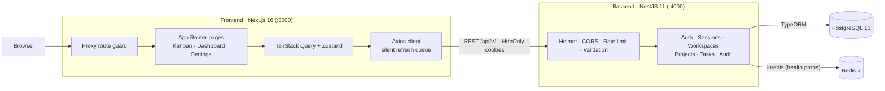

# TaskFlow — SaaS Project Management Platform

<p align="center">
  <strong>A full-stack, multi-tenant project management app with Kanban boards, team workspaces and secure cookie-based authentication.</strong><br>
  <em>Next.js 16 · React 19 · NestJS 11 · TypeScript · PostgreSQL 16 · Redis 7 · Docker</em>
</p>

<p align="center">
  <a href="https://github.com/dhruvchaudhari1606/TaskFlow/actions/workflows/ci.yml"></a>
  <a href="LICENSE"></a>
  
  
  
  
  
</p>

---

## Overview

**TaskFlow** is a project management platform inspired by tools like Linear and Jira. Teams organise work into **workspaces**, plan it in **projects**, and execute it on a **drag-and-drop Kanban board** with comments, priorities, assignees and a live analytics dashboard.

The repository is a monorepo with two independently deployable apps:

| App | Stack | Docs |
| :-- | :-- | :-- |
| [`backend/`](backend) | NestJS 11 REST API, TypeORM + PostgreSQL, Redis, Swagger | [Backend README](backend/README.md) |
| [`frontend/`](frontend) | Next.js 16 App Router, React 19, Tailwind CSS v4, TanStack Query, Zustand | [Frontend README](frontend/README.md) |

## Highlights

- **Secure session handling** — Access and refresh tokens live only in `HttpOnly` cookies (never `localStorage`). Refresh-token rotation runs inside a PostgreSQL transaction with a row lock (`SELECT … FOR UPDATE`), and reusing an old refresh token revokes every session for that user.
- **Multi-tab friendly** — A 30-second rotation grace window stops parallel tabs from tripping the reuse detector. On the client, concurrent `401`s share a single refresh request and are replayed transparently.
- **Kanban board** — `@dnd-kit` drag-and-drop with optimistic updates, custom board columns per project, inline task creation, filters and a task detail modal with comments.
- **Multi-tenant workspaces** — Workspace isolation, member roles (owner / admin / member), email invitations and role-based access control backed by a permissions table.
- **Analytics dashboard** — Task status distribution, project progress and recent activity, rendered with Recharts.
- **Production-minded backend** — Joi-validated config, global validation pipe, Helmet security headers, CORS allow-list, rate limiting, structured audit log, Sentry integration with secret redaction, and migration-only schema changes (`synchronize: false`).
- **Tested & automated** — 290+ backend unit and e2e tests, ESLint + strict TypeScript on both apps, multi-stage Docker images, and a GitHub Actions pipeline that boots the full stack and smoke-tests it.

## Architecture



## Quick start (Docker)

The fastest way to run the whole stack. The only requirement is [Docker](https://docs.docker.com/get-docker/) with Compose v2.

```bash
git clone https://github.com/dhruvchaudhari1606/TaskFlow.git
cd TaskFlow
docker compose up -d --build
```

On startup, the backend container applies all database migrations and loads the demo data. When every service reports healthy, open:

| Service | URL |
| :-- | :-- |
| Web app | http://localhost:3000 |
| REST API | http://localhost:4000/api/v1 |
| Swagger / OpenAPI | http://localhost:4000/api/docs |
| Health check | http://localhost:4000/api/v1/health |

PostgreSQL and Redis are not published to the host, so they won't clash with local installs. Run `docker compose down -v` to stop everything and remove the data volumes.

> [!NOTE]
> The secrets in `docker-compose.yml` are **local-demo defaults**. Override them with environment variables (for example `JWT_SECRET`, `DB_PASSWORD`) before running the stack anywhere other than your own machine.

## Demo accounts

The seed script creates a sample workspace (**Alpha Operations**) with projects, board columns and tasks:

| User | Email | Password |
| :-- | :-- | :-- |
| Sarah Mitchell (workspace owner) | `sarah@northstar.io` | `password123` |
| Alex Rivera | `alex@brightlabs.com` | `password123` |
| Elena Chen | `elena@design.io` | `password123` |

New sign-ups are verified with a 6-digit email OTP. If no mail provider is configured, the code is printed to the backend logs (`docker compose logs backend`).

## Local development

**Prerequisites:** Node.js 22+, PostgreSQL 16+, Redis 7+.

**1. Backend** (http://localhost:4000)

```bash
cd backend
npm install
cp .env.example .env.development   # then set DB_* and the JWT_* secrets
npm run migration:run
npm run seed:run
npm run start:dev
```

**2. Frontend** (http://localhost:3000), in a second terminal:

```bash
cd frontend
npm install
echo "NEXT_PUBLIC_API_URL=http://localhost:4000/api/v1" >  .env.local
echo "NEXT_PUBLIC_APP_URL=http://localhost:3000"       >> .env.local
npm run dev
```

## Quality checks & CI

Every push and pull request to `main` runs the [CI workflow](.github/workflows/ci.yml):

| Job | What it checks |
| :-- | :-- |
| **Backend** | ESLint, `tsc --noEmit`, Jest unit tests with coverage, e2e tests, production build |
| **Frontend** | ESLint, `tsc --noEmit`, Next.js production build |
| **Docker** | Builds both images and starts the full Compose stack. Checks that the API health endpoint responds, that a demo login succeeds (proving migrations and seed ran), and that the web app is served |
| **Dependency audit** | `npm audit` for high/critical advisories (informational) |

Run the same checks locally:

```bash
# backend/
npm run lint && npm run type-check && npm test && npm run test:e2e && npm run build
# frontend/
npm run lint && npm run type-check && npm run build
```

## Repository structure

```text
TaskFlow/
├── .github/workflows/ci.yml   # GitHub Actions pipeline
├── backend/                   # NestJS API — see backend/README.md
│   ├── src/
│   │   ├── common/            # Guards, interceptors, filters, decorators, utils
│   │   ├── config/            # Typed config, env validation, Swagger, Sentry
│   │   ├── database/          # Entities, migrations, seeders, data source
│   │   └── modules/           # auth, sessions, users, authorization, workspaces,
│   │                          # projects, tasks, audit, mail, health, …
│   ├── test/e2e/              # End-to-end suites (supertest)
│   ├── Dockerfile
│   └── docker-entrypoint.sh   # Runs migrations / seed, then starts the API
├── frontend/                  # Next.js web client — see frontend/README.md
│   ├── src/
│   │   ├── app/               # App Router: (marketing), (auth), (dashboard)
│   │   ├── components/        # ui primitives, layout, common
│   │   ├── features/          # Feature modules: tasks/kanban, projects, workspace, …
│   │   ├── lib/api/           # Axios client + silent-refresh interceptors
│   │   ├── stores/            # Zustand stores
│   │   └── proxy.ts           # Route guard (Next.js 16 proxy)
│   └── Dockerfile
├── docker-compose.yml         # Full stack: postgres, redis, backend, frontend
├── SECURITY.md
└── LICENSE
```

## Security

See [SECURITY.md](SECURITY.md) for the security design and how to report a vulnerability.

## License

Released under the [MIT License](LICENSE) © 2026 Dhruv Chaudhari.
