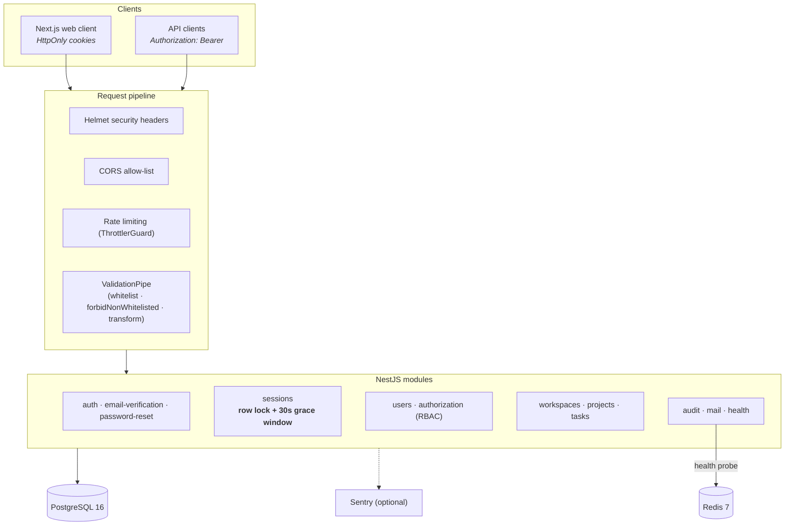
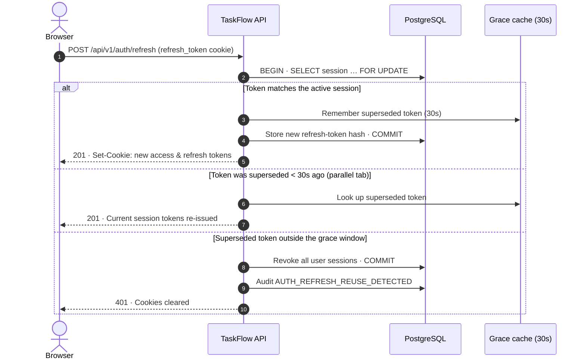
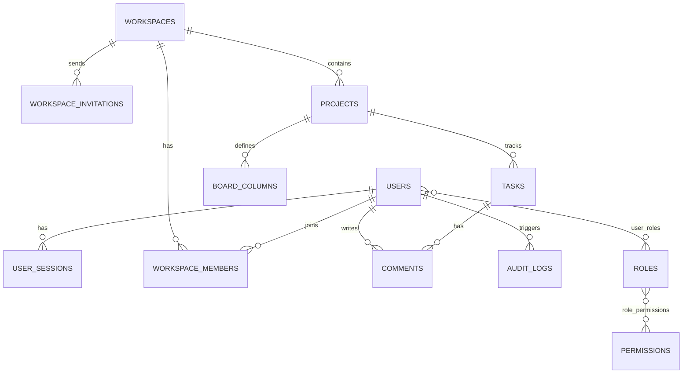

# TaskFlow — Backend API

The REST API behind [TaskFlow](../README.md). It handles authentication and sessions, multi-tenant workspaces, projects, Kanban tasks, comments and audit logging.

**Stack:** NestJS 11 · TypeScript 5.9 · PostgreSQL 16 (TypeORM 0.3) · Redis 7 (ioredis) · Swagger / OpenAPI · Jest · Docker

---

## Contents

- [Design highlights](#design-highlights)
- [Architecture](#architecture)
- [Refresh-token rotation](#refresh-token-rotation)
- [Data model](#data-model)
- [API reference](#api-reference)
- [Getting started](#getting-started)
- [Scripts](#scripts)
- [Configuration](#configuration)
- [Docker](#docker)
- [Testing](#testing)

## Design highlights

1. **Cookie-only token transport.** Access and refresh tokens are issued as `HttpOnly`, `SameSite` cookies and are never returned in response bodies. A `Bearer` header is also accepted for non-browser clients.
2. **Concurrency-safe rotation.** Refreshing a session runs in a transaction that row-locks the session (`pessimistic_write`, which issues `SELECT … FOR UPDATE`), so two simultaneous refreshes can't both rotate the same token.
3. **Rotation grace window.** The token that was just replaced stays valid for 30 seconds. Parallel tabs that refresh at the same moment get the current session back instead of triggering reuse detection.
4. **Reuse detection.** If a superseded refresh token turns up outside the grace window, every session for that user is revoked and an `AUTH_REFRESH_REUSE_DETECTED` audit event is logged. Bumping a user's `token_version` invalidates all of their outstanding access tokens.
5. **Migration-driven schema.** `synchronize` is off in every environment, and all schema changes ship as TypeORM migrations.
6. **Defence in depth.** The app uses Helmet headers (CSP, frameguard, no-sniff), a strict CORS allow-list, global and per-route rate limiting, a whitelisting `ValidationPipe`, and bcrypt password hashing. Password-reset tokens are stored as SHA-256 hashes and wiped after use. Sentry integration redacts cookies, auth headers and sensitive request fields.

## Architecture



## Refresh-token rotation



> The grace cache is held in process memory, so it applies per API instance. If you scale horizontally, move it to Redis.

## Data model

Core tables (managed by migrations in [`src/database/migrations`](src/database/migrations)):



Supporting tables: `email_verifications` (hashed OTPs) and `password_resets` (hashed reset tokens).

## API reference

All routes are prefixed with **`/api/v1`**. Full request and response schemas are in Swagger at **http://localhost:4000/api/docs**.

<details>
<summary><b>Auth & account</b></summary>

| Method | Path | Auth | Description |
| :-- | :-- | :-: | :-- |
| `POST` | `/auth/register` | — | Create an account and email a 6-digit OTP |
| `POST` | `/auth/verify-otp` | — | Verify the OTP, create a first workspace, start a session |
| `POST` | `/auth/resend-otp` | — | Send a new OTP |
| `POST` | `/auth/login` | — | Authenticate and set session cookies |
| `POST` | `/auth/refresh` | Cookie | Rotate the refresh token |
| `POST` | `/auth/logout` | Cookie | End the current session |
| `POST` | `/auth/logout-all` | ✔ | Revoke every session for the user |
| `POST` | `/auth/change-password` | ✔ | Change password (requires current password) |
| `POST` | `/auth/forgot-password` | — | Email a password-reset link |
| `POST` | `/auth/reset-password` | — | Reset password with a token and revoke all sessions |
| `POST` | `/auth/verify-email` | — | Verify email via link token |
| `POST` | `/auth/resend-verification` | — | Resend the verification email |

</details>

<details>
<summary><b>Users, sessions & RBAC</b></summary>

| Method | Path | Auth | Description |
| :-- | :-- | :-: | :-- |
| `GET` | `/users/me` · `/users/profile` | ✔ | Current user profile |
| `PATCH` | `/users/profile` | ✔ | Update name |
| `GET` | `/users` | Admin | Paginated user search |
| `GET` | `/sessions` | ✔ | List active sessions and devices |
| `DELETE` | `/sessions/:id` | ✔ | Revoke one session |
| `DELETE` | `/sessions` | ✔ | Revoke all sessions (`?keepCurrent=true` keeps this one) |
| `GET` · `POST` | `/roles` | Admin | List or create roles |
| `GET` · `PATCH` · `DELETE` | `/roles/:id` | Admin | Read, update or delete a role |
| `POST` | `/roles/:id/permissions` | Admin | Assign permissions to a role |
| `GET` | `/permissions` | Admin | List permissions |
| `POST` | `/users/:id/roles` | Admin | Assign a role to a user |
| `DELETE` | `/users/:id/roles/:roleName` | Admin | Remove a role from a user |

</details>

<details>
<summary><b>Workspaces</b></summary>

| Method | Path | Auth | Description |
| :-- | :-- | :-: | :-- |
| `GET` · `POST` | `/workspaces` | ✔ | List my workspaces or create one (auto slug) |
| `GET` · `PATCH` · `DELETE` | `/workspaces/:id` | ✔ | Read, update or delete a workspace |
| `GET` | `/workspaces/:id/members` | ✔ | List members and roles |
| `POST` | `/workspaces/:id/members` | ✔ | Invite by email, or add an existing user |
| `GET` | `/workspaces/:id/invitations` | ✔ | List pending invitations |
| `DELETE` | `/workspaces/:id/invitations/:invitationId` | ✔ | Cancel an invitation |
| `GET` | `/workspaces/invitations/:token` | — | Look up an invitation (public) |
| `POST` | `/workspaces/invitations/:token/accept` | — | Accept an invitation and join or register |

</details>

<details>
<summary><b>Projects, board columns & tasks</b></summary>

| Method | Path | Auth | Description |
| :-- | :-- | :-: | :-- |
| `GET` | `/projects?workspaceId=` | ✔ | List projects in a workspace |
| `POST` | `/projects` | ✔ | Create a project |
| `GET` · `PATCH` · `DELETE` | `/projects/:id` | ✔ | Read, update or delete a project |
| `GET` | `/projects/:id/health` | ✔ | Completion and status breakdown |
| `GET` · `POST` | `/projects/:projectId/columns` | ✔ | List or add board columns |
| `PATCH` · `DELETE` | `/projects/:projectId/columns/:columnId` | ✔ | Update (name, colour) or delete a column |
| `POST` | `/projects/:projectId/columns/reorder` | ✔ | Persist column order |
| `GET` | `/tasks?projectId=` · `/tasks?workspaceId=` | ✔ | List tasks for a project or workspace |
| `POST` | `/tasks` | ✔ | Create a task |
| `GET` · `PATCH` · `DELETE` | `/tasks/:id` | ✔ | Read, update or delete a task |
| `PATCH` | `/tasks/:id/reorder` | ✔ | Move a task to another column or position (drag-and-drop) |
| `GET` · `POST` | `/tasks/:id/comments` | ✔ | Read or post comments |

</details>

<details>
<summary><b>Health</b></summary>

| Method | Path | Auth | Description |
| :-- | :-- | :-: | :-- |
| `GET` | `/health` | — | Liveness and readiness. Checks PostgreSQL and Redis, and returns `503` if either is down |

</details>

## Getting started

**Prerequisites:** Node.js 22+, PostgreSQL 16+ and Redis 7+, running locally or via `docker compose up -d postgres redis` from the repo root.

```bash
npm install
cp .env.example .env.development     # set DB_* and generate the JWT_* secrets
npm run migration:run                # apply schema migrations
npm run seed:run                     # roles, permissions, admin + demo workspace
npm run start:dev                    # http://localhost:4000/api/v1
```

Without a mail provider configured, verification OTPs and password-reset links are printed to the console.

## Scripts

| Script | Description |
| :-- | :-- |
| `npm run start:dev` | Start in watch mode (`NODE_ENV=development`) |
| `npm run build` | Compile to `dist/` |
| `npm run start:prod` | Run the compiled build |
| `npm run lint` · `npm run lint:fix` | ESLint + Prettier |
| `npm run type-check` | `tsc --noEmit` |
| `npm test` · `npm run test:cov` | Unit tests (with coverage) |
| `npm run test:e2e` | End-to-end HTTP tests |
| `npm run migration:run` · `migration:revert` · `migration:generate` | TypeORM migrations via ts-node (`:staging` / `:prod` variants available) |
| `npm run seed:run` | Idempotent seeders |
| `npm run migration:run:dist` · `seed:run:dist` | Same, from the compiled build (used inside the Docker image) |

## Configuration

Configuration is loaded from `.env.<NODE_ENV>` and validated at startup with Joi. Startup fails fast if a required variable is missing. [`.env.example`](.env.example) documents every option. The main groups are:

| Group | Variables |
| :-- | :-- |
| App | `APP_PORT`, `APP_ENV`, `TRUST_PROXY`, `CORS_ORIGIN` |
| Database | `DB_HOST`, `DB_PORT`, `DB_USER`, `DB_PASSWORD`, `DB_NAME` |
| Redis | `REDIS_HOST`, `REDIS_PORT`, `REDIS_PASSWORD`, `REDIS_DB`, `REDIS_KEY_PREFIX` |
| JWT | `JWT_SECRET`, `JWT_ACCESS_SECRET`, `JWT_REFRESH_SECRET`, `JWT_*_EXPIRES_IN` |
| Cookies | `COOKIE_SECURE`, `COOKIE_SAME_SITE`, `COOKIE_DOMAIN`, `COOKIE_ACCESS_NAME`, `COOKIE_REFRESH_NAME` |
| Mail | `MAIL_PROVIDER` (`nodemailer` · `sendgrid` · `google`) plus provider credentials |
| Security | `BCRYPT_SALT_ROUNDS`, `RATE_LIMIT_TTL`, `RATE_LIMIT_MAX` |
| Monitoring | `SENTRY_DSN` |
| Seeding | `SEED_ADMIN_EMAIL`, `SEED_ADMIN_PASSWORD` (required when `NODE_ENV=production`) |

## Docker

The [`Dockerfile`](Dockerfile) is a multi-stage build. It compiles TypeScript, installs only production dependencies, and runs as the unprivileged `node` user. The image contains no `.env` files; all configuration comes from environment variables.

At startup, [`docker-entrypoint.sh`](docker-entrypoint.sh):

1. runs pending migrations (`RUN_MIGRATIONS`, default `true`);
2. loads demo data if `SEED_DEMO_DATA=true`;
3. starts the API.

Use the root [`docker-compose.yml`](../docker-compose.yml) to run the API with PostgreSQL, Redis and the frontend.

## Testing

- **Unit tests** cover services, guards, interceptors, DTO validation, config and utilities.
- **E2E tests** ([`test/e2e`](test/e2e)) boot the Nest HTTP layer with supertest and mocked persistence. They cover auth flows, sessions, RBAC, health and security headers.

Both suites run in CI on every push and pull request, alongside lint, type-check and a production build.

## License

[MIT](../LICENSE)
